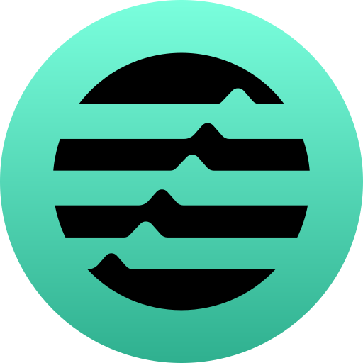
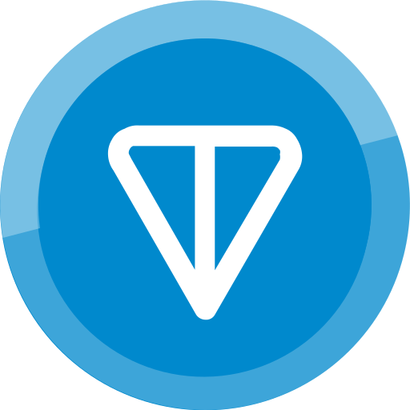
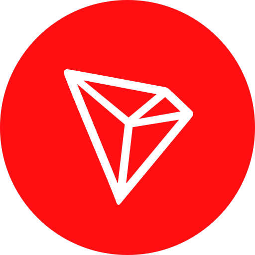
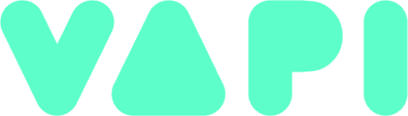

  <h2>💦 Full-Stack Software Developer | AI, Web3 & Scalable Systems 💦</h2>

<h4>𝓘’𝓶 𝓪 𝓼𝓸𝓯𝓽𝔀𝓪𝓻𝓮 𝓭𝓮𝓿𝓮𝓵𝓸𝓹𝓮𝓻 𝓯𝓸𝓬𝓾𝓼𝓮𝓭 𝓸𝓷 𝓫𝓾𝓲𝓵𝓭𝓲𝓷𝓰 𝓹𝓻𝓸𝓭𝓾𝓬𝓽𝓼 𝓽𝓱𝓪𝓽 𝓪𝓬𝓽𝓾𝓪𝓵𝓵𝔂 𝔀𝓸𝓻𝓴, 𝓷𝓸𝓽 𝓳𝓾𝓼𝓽 𝓲𝓷 𝓽𝓱𝓮𝓸𝓻𝔂, 𝓫𝓾𝓽 𝓲𝓷 𝓽𝓱𝓮 𝓻𝓮𝓪𝓵 𝔀𝓸𝓻𝓵𝓭.</h4>

<h4>𝓘’𝓿𝓮 𝔀𝓸𝓻𝓴𝓮𝓭 𝓪𝓬𝓻𝓸𝓼𝓼 20+ 𝓹𝓻𝓸𝓳𝓮𝓬𝓽𝓼 𝓲𝓷 𝓲𝓷𝓭𝓾𝓼𝓽𝓻𝓲𝓮𝓼 𝓵𝓲𝓴𝓮 𝓮𝓷𝓮𝓻𝓰𝔂, 𝓲𝓷𝓭𝓾𝓼𝓽𝓻𝓲𝓪𝓵 𝓪𝓾𝓽𝓸𝓶𝓪𝓽𝓲𝓸𝓷, 𝓐𝓘, 𝓶𝓪𝓻𝓴𝓮𝓽𝓹𝓵𝓪𝓬𝓮𝓼, 𝓦𝓮𝓫3, 𝓪𝓷𝓭 𝓮-𝓬𝓸𝓶𝓶𝓮𝓻𝓬𝓮. 𝓣𝓱𝓪𝓽 𝓻𝓪𝓷𝓰𝓮 𝓽𝓪𝓾𝓰𝓱𝓽 𝓶𝓮 𝓱𝓸𝔀 𝓽𝓸 𝓺𝓾𝓲𝓬𝓴𝓵𝔂 𝓾𝓷𝓭𝓮𝓻𝓼𝓽𝓪𝓷𝓭 𝓭𝓲𝓯𝓯𝓮𝓻𝓮𝓷𝓽 𝓼𝔂𝓼𝓽𝓮𝓶𝓼, 𝓪𝓭𝓪𝓹𝓽 𝓯𝓪𝓼𝓽, 𝓪𝓷𝓭 𝓭𝓮𝓵𝓲𝓿𝓮𝓻 𝓼𝓸𝓵𝓾𝓽𝓲𝓸𝓷𝓼 𝓽𝓱𝓪𝓽 𝓶𝓪𝓴𝓮 𝓼𝓮𝓷𝓼𝓮 𝓯𝓸𝓻 𝓽𝓱𝓮 𝓫𝓾𝓼𝓲𝓷𝓮𝓼𝓼, 𝓷𝓸𝓽 𝓳𝓾𝓼𝓽 𝓽𝓱𝓮 𝓬𝓸𝓭𝓮.</h4>

<h4>𝓘 𝓬𝓪𝓻𝓮 𝓪𝓫𝓸𝓾𝓽 𝓼𝓲𝓶𝓹𝓵𝓲𝓬𝓲𝓽𝔂, 𝓹𝓮𝓻𝓯𝓸𝓻𝓶𝓪𝓷𝓬𝓮, 𝓪𝓷𝓭 𝓻𝓮𝓵𝓲𝓪𝓫𝓲𝓵𝓲𝓽𝔂. 𝓘 𝓭𝓸𝓷’𝓽 𝓸𝓿𝓮𝓻𝓬𝓸𝓶𝓹𝓵𝓲𝓬𝓪𝓽𝓮 𝓽𝓱𝓲𝓷𝓰𝓼. 𝓘 𝓫𝓾𝓲𝓵𝓭 𝓼𝔂𝓼𝓽𝓮𝓶𝓼 𝓽𝓱𝓪𝓽 𝓪𝓻𝓮 𝓬𝓵𝓮𝓪𝓷, 𝓼𝓬𝓪𝓵𝓪𝓫𝓵𝓮, 𝓪𝓷𝓭 𝓮𝓪𝓼𝔂 𝓽𝓸 𝓶𝓪𝓲𝓷𝓽𝓪𝓲𝓷.</h4>

<h4>𝓦𝓱𝓮𝓷 𝓘 𝓽𝓪𝓴𝓮 𝓸𝓷 𝓪 𝓹𝓻𝓸𝓳𝓮𝓬𝓽, 𝓘 𝓽𝓻𝓮𝓪𝓽 𝓲𝓽 𝓵𝓲𝓴𝓮 𝓶𝔂 𝓸𝔀𝓷. 𝓘 𝓽𝓱𝓲𝓷𝓴 𝓫𝓮𝔂𝓸𝓷𝓭 𝓽𝓱𝓮 𝓽𝓪𝓼𝓴, 𝓪𝓫𝓸𝓾𝓽 𝓾𝓼𝓮𝓻𝓼, 𝓰𝓻𝓸𝔀𝓽𝓱, 𝓪𝓷𝓭 𝓵𝓸𝓷𝓰-𝓽𝓮𝓻𝓶 𝓲𝓶𝓹𝓪𝓬𝓽.</h4>

<h4>𝓘𝓯 𝓘 𝓫𝓮𝓵𝓲𝓮𝓿𝓮 𝓲𝓷 𝔀𝓱𝓪𝓽 𝓘’𝓶 𝓫𝓾𝓲𝓵𝓭𝓲𝓷𝓰, 𝓘’𝓶 𝓪𝓵𝓵 𝓲𝓷. 𝓘’𝓵𝓵 𝓫𝓮 𝓽𝓱𝓲𝓷𝓴𝓲𝓷𝓰 𝓪𝓫𝓸𝓾𝓽 𝓲𝓽, 𝓲𝓶𝓹𝓻𝓸𝓿𝓲𝓷𝓰 𝓲𝓽, 𝓪𝓷𝓭 𝓹𝓾𝓼𝓱𝓲𝓷𝓰 𝓲𝓽 𝓯𝓸𝓻𝔀𝓪𝓻𝓭, 𝓫𝓮𝓬𝓪𝓾𝓼𝓮 𝓽𝓱𝓪𝓽’𝓼 𝓳𝓾𝓼𝓽 𝓱𝓸𝔀 𝓘 𝔀𝓸𝓻𝓴.</h4>

 

# 
<table align="center">
<!-- skill -->
  <tr>
    <td align="center" width="90">
      
       Javascript
    </td>
    <td align="center" width="90">
      
       Typescript
    </td>
    <td align="center" width="90">
      
       Rust
    </td>
     <td align="center" width="90">
      
       Solidity
    </td>
    <td align="center" width="90">
      
       Python
    </td>
    <td align="center" width="90">
      
       C++
    </td>
    <td align="center" width="90">
      
       GoLang
    </td>
    <td align="center" width="90">
      
       PHP
    </td>
    <td align="center" width="90">
      
       Ruby
    </td>
    <td align="center" width="90">
      
       java
    </td>
  </tr>
  <!-- network -->
<tr>
  <td align="center" width="90">
    
     Solana
  </td>
  <td align="center" width="90">
    
     Ethereum
  </td>
  <td align="center" width="90">
    
     Bitcoin
  </td>
  <td align="center" width="90">
    
     Aptos
  </td>
  <td align="center" width="90">
    
     Polkadot
  </td>
  <td align="center" width="90">
    
     Cosmos
  </td>
  <td align="center" width="90">
    
     Polygon
  </td>
  <td align="center" width="90">
    
     Ton
  </td>
  <td align="center" width="90">
    
     Tron
  </td>
  <td align="center" width="90">
    
     Sui
  </td>
</tr>
<tr>
    <td align="center" width="90">
      
       Nodejs
    </td>
    <td align="center" width="90">
      
       Express
    </td>
    <td align="center" width="90">
      
       React
    </td>
    <td align="center" width="90">
      
       Next.js
    </td>
    <td align="center" width="90">
      
       Django
    </td>
    <td align="center" width="90">
      
       Laravel
    </td>
    <td align="center" width="90">
      
       Angular
    </td>
    <td align="center" width="90">
      
       PostgreSQL
    </td>
    <td align="center" width="90">
      
       MongoDB
    </td>
    <td align="center" width="90">
      
       MySQL
    </td>
  </tr>
<!-- common -->
  <tr>
    <td align="center" width="90">
      
       OpenAI
    </td>
    <td align="center" width="90">
      
       DeepSeek
    </td>
    <td align="center" width="90">
      
       LangChain
    </td>
    <td align="center" width="90">
      
       Hugging Face
    </td>
    <td align="center" width="90">
      
       ElizaOS
    </td>
    <td align="center" width="90">
      
       TensorFlow
    </td>
    <td align="center" width="90">
      
       PyTorch
    </td>
    <td align="center" width="90">
      
       Ollama
    </td>
    <td align="center" width="90">
      
       FastAPI
    </td>
    <td align="center" width="90">
      
       VApi
    </td>
  </tr>
  
</table>
 

     

